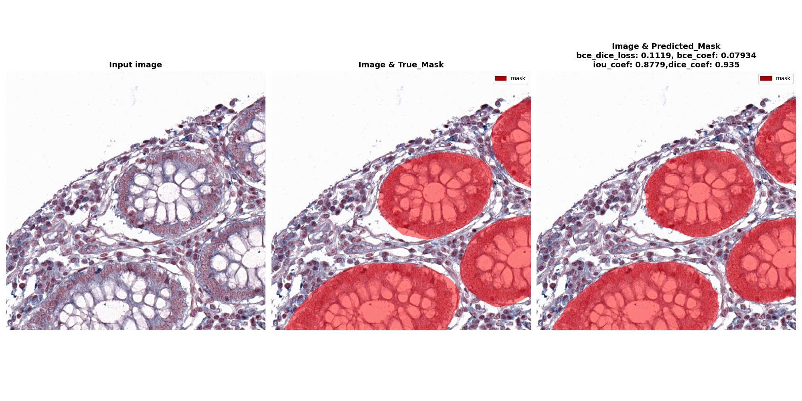

# HuBMAP + HPA - Hacking the Human Body.
# 🚀 Competition introduction

The goal of this competition is to identify the locations of each 
 ** functional tissue unit (FTU) **  in biopsy slides from several different organs. The underlying data includes imagery from **  different sources **  prepared with ** 
 different protocols  **  at a ** variety of resolutions **, reflecting typical challenges for working with medical data. 

This competition uses data from two different consortia, ** the Human Reference Atlas (HPA) ** and  ** Human BioMolecular Atlas Program (HuBMAP) ** .

The data is sourced as following:
* The training dataset consists of data from public HPA data.
* The public test set is a combination of private HPA data and HuBMAP data.
* The private test set contains only HuBMAP data.

** Adapting models to function properly when presented with data that was prepared using a different protocol will
be one of the core challenges of this competition. While this is expected to make the problem more difficult,
developing models that generalize is a key goal of this endeavor. **

https://www.kaggle.com/competitions/hubmap-organ-segmentation

## Technologies
<ul>
  <li>Python</li>
  <li>Tensorflow</li>
  <li>Keras</li>
  <li>sklearn</li>
  <li>skimage</li>
  <li>Numpy</li>
  <li>Matplotlib</li>
  <li>albumentations</li>
  <li>1x NVIDIA RTX A6000</li>
</ul>

## ⚽ Wandb report
Check results on: https://wandb.ai/jordiarellano1996/HuBMAP

## 🤫 Investigate  image sizes
### Observations
* Globally, we can see that most of the images are dominated by a single size  (3000×3000)
* All the other sizes (19) only have 1 or 2 occurrences each.
* All image size are square

**  NOTE: THE HOSTS TELL US THAT ALL HPA IMAGES SHOULD BE 3000x3000... HOWEVER, WE CAN SEE THAT ISN'T THE CASE **

### Other observations
* Expect roughly 550 images in the hidden test set.
* All HPA images are 3000 x 3000 pixels with a tissue area within the image around 2500 x 2500 pixels.
* The Hubmap images range in size from 4500x4500 down to 160x160 pixels.

### Train Data Loader
My train data loader each epoch selects 50 random crops from each of the 350 train images.
Therefore it balances the contribution from each train image (it does not give more attention to larger train images)
since we don't know what the images in private test look like.
Lastly, the data loader guarantees that each crop of 640x640 contains at least 1 segmentation label.
(If not, randomly select again).

## Results on evaluation data 🚀
### Large intestine

### Kidney

### Spleen

### Prostate

### Lung

## Results on test data 🚀
Coming soon!

## Feature engineering 🚀
* Improve performance on lung segmentation.
* Use GAN (General Adversarial Networks) for data augmentation instead of albumentations.
